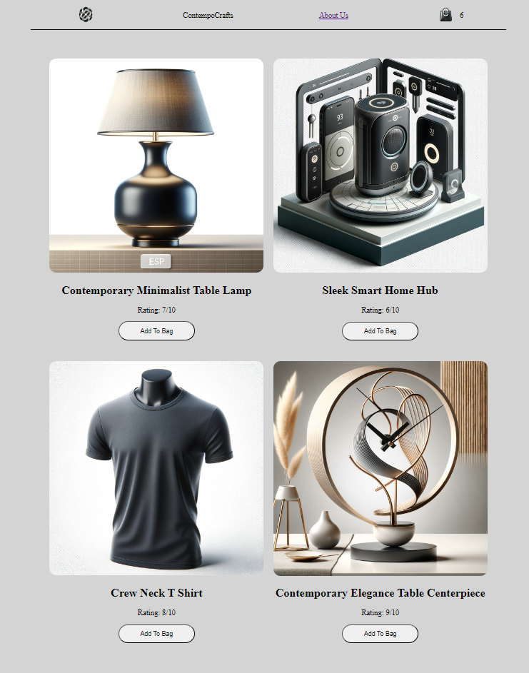
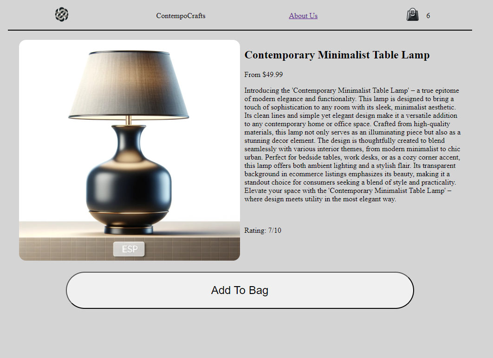
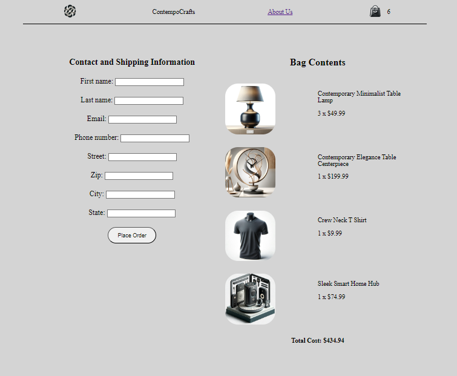

# ContempoCrafts E-Commerce Application

Welcome to ContempoCrafts, an ambitious e-commerce application that combines functionality, aesthetics, and user experience into a seamless digital shopping platform. Crafted over a focused 14-day development sprint, this project is a testament to the power of modern web technologies.

## Explore ContempoCrafts

### Application Showcase

- **Homepage**: A welcoming first glance into our product world, designed for immediate engagement and ease of navigation.

- **Product Detail**: Each product's story is intricately detailed, providing users with all the information they need to make informed decisions.
  

- **Checkout**: A streamlined and intuitive checkout process, ensuring a pleasant conclusion to the shopping experience.
  

## Project Insights

### Time Allocated
- A mere **14 days** were allocated to transition from concept to MVP, highlighting efficient project management and development practices.

### Tech Stack
- **Django & PostgreSQL**: For robust backend functionality and data management.
- **HTML & CSS (Grid and Flexbox)**: Crafting responsive and aesthetically pleasing layouts.
- **Vanilla JavaScript / Document Object Model API**: Enhancing the frontend with dynamic content and interactive elements.

## Core Features

### E-Commerce MVP Design
- A comprehensive system encompassing a product bag, detailed product pages, and a checkout process, meticulously designed to cater to the end-user's shopping experience.

### Dynamic Bag/Checkout System
- Utilizing JavaScript for real-time updates and Django for session-based storage, we've created an intuitive shopping bag system that effortlessly scales across user sessions.

### Responsive Web Design
- Employing CSS Grid and Flexbox, the application adapts fluidly across devices, offering a consistent user experience regardless of the viewing platform.

## Behind the Scenes: Implementation Journey

- **AJAX and Django**: A harmonious integration enabling dynamic content updates without page reloads, improving the user experience by leaps and bounds.
- **Django's ORM and Model Complexity**: Leveraging Django's powerful ORM to manage complex data relationships, showcasing the application's robust data architecture.

## Future Roadmap

- Introduction of **payment integration**, **advanced accessibility features**, and **mobile optimization**, ensuring ContempoCrafts remains at the forefront of e-commerce innovation.

## Reflecting on the Journey

This project was not just a demonstration of technical skill but a significant learning experience. It challenged preconceived notions, demanded innovative solutions, and ultimately, fostered a deeper understanding of what it means to build meaningful software in today's digital age.
